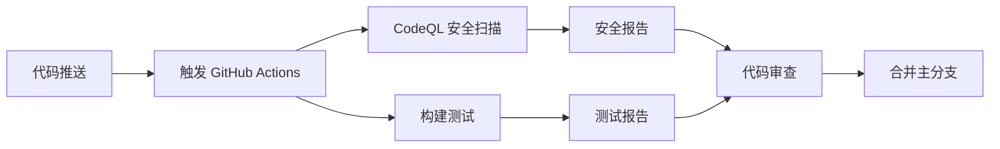

# Java21Days - 21天学会Java

一个系统性的 Java 学习项目，通过21天的学习计划帮助初学者掌握 Java 编程基础。

## 项目概述

本项目旨在为 Java 初学者提供一个循序渐进的学习路径，通过实践项目和代码示例，在21天内建立扎实的 Java 编程基础。

## 学习目标

- 掌握 Java 语言基础语法
- 理解面向对象编程概念
- 学习常用的 Java 类库和 API
- 培养良好的编程习惯和代码规范
- 通过实际项目巩固所学知识

## 技术栈

- **编程语言**: Java
- **构建工具**: Bazel
- **CI/CD**: GitHub Actions
- **代码质量**: CodeQL 安全扫描
- **测试框架**: BuildBuddy 集成测试
- **版本控制**: Git

## 项目结构

```
java21days/
├── .github/
│   └── workflows/          # GitHub Actions 工作流
│       ├── demo.yml        # GitHub Actions 基础演示
│       ├── blank.yml       # CI 模板结构
│       ├── learn-github-actions.yml  # Node.js/bats 测试演示
│       └── codeql.yml      # CodeQL 安全扫描
├── src/                    # Java 源代码目录
├── tests/                  # 测试代码目录
├── docs/                   # 项目文档
├── BUILD                   # Bazel 构建配置
├── WORKSPACE               # Bazel 工作区配置
└── README.md              # 项目说明文档
```

## 自动化工作流

### 1. 代码安全扫描 (CodeQL)
- **触发条件**: 推送到 main 分支、Pull Request、定时扫描
- **扫描语言**: Java, JavaScript, TypeScript, Python, C/C++, C#, Go, Ruby, Kotlin, Swift
- **功能**: 静态代码分析，发现潜在安全漏洞和代码质量问题

### 2. 持续集成演示 (demo.yml)
- **触发条件**: 推送、Pull Request、手动触发
- **功能**: 展示 GitHub Actions 基础功能，包括事件信息显示和环境配置

### 3. 学习演示工作流 (learn-github-actions.yml)
- **技术栈**: Node.js + bats 测试框架
- **功能**: 演示完整的 CI/CD 流程，包括依赖安装、测试执行和结果报告

### 4. CI 模板 (blank.yml)
- **触发方式**: 手动触发
- **用途**: 提供可重用的 CI 模板结构

## CI/CD 流程



## 安全特性

- **多语言支持**: 支持10+种编程语言的安全扫描
- **自动化检测**: 每次代码变更自动触发安全扫描
- **定期扫描**: 每周日 17:35 (UTC) 自动安全检查
- **威胁建模**: 识别常见的安全漏洞模式
- **合规性检查**: 确保代码符合安全最佳实践

## 开发环境设置

### 前置要求
- Java 8 或更高版本
- Bazel 构建工具
- Git 版本控制

### 快速开始

1. 克隆项目
```bash
git clone https://github.com/feitianmao2024/java21days.git
cd java21days
```

2. 构建项目
```bash
bazel build //...
```

3. 运行测试
```bash
bazel test //...
```

## 学习计划

### 第一周：Java 基础
- Day 1-3: Java 语法基础，变量和数据类型
- Day 4-5: 控制流程（条件和循环）
- Day 6-7: 方法和数组

### 第二周：面向对象编程
- Day 8-10: 类和对象
- Day 11-12: 继承和多态
- Day 13-14: 接口和抽象类

### 第三周：高级特性和实践
- Day 15-17: 异常处理和文件 I/O
- Day 18-19: 集合框架
- Day 20-21: 综合项目实践

## 贡献指南

我们欢迎所有形式的贡献！

### 如何贡献
1. Fork 本项目
2. 创建特性分支 (`git checkout -b feature/AmazingFeature`)
3. 提交更改 (`git commit -m 'Add some AmazingFeature'`)
4. 推送到分支 (`git push origin feature/AmazingFeature`)
5. 开启 Pull Request

### 代码规范
- 遵循 Java 编码规范
- 添加适当的注释和文档
- 确保所有测试通过
- 通过 CodeQL 安全扫描

## 许可证

本项目采用开源许可证，详情请查看 [LICENSE](LICENSE) 文件。

## 联系方式

如有问题或建议，欢迎通过以下方式联系：
- 提交 GitHub Issue
- 发起 Pull Request
- 项目讨论区

---

**Happy Coding! 🎉**

祝大家新年快乐，学习进步！
