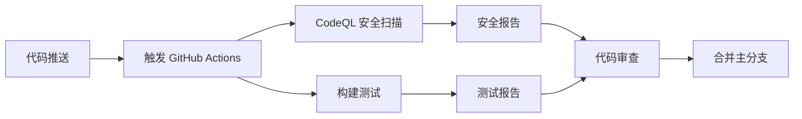

# Java21Days - 21天学会Java 🚀

<div align="center">

[](https://github.com/feitianmao2024/java21days/stargazers)
[](https://github.com/feitianmao2024/java21days/network/members)
[](https://github.com/feitianmao2024/java21days/issues)
[](https://github.com/feitianmao2024/java21days/blob/main/LICENSE)
[](https://adoptium.net/)
[](https://github.com/feitianmao2024/java21days/pulls)
[](https://github.com/feitianmao2024/java21days/commits/main)

</div>

<p align="center">
  
</p>

<div align="center">

一个**系统性的 Java 学习项目**，通过精心设计的21天学习计划帮助初学者从零基础到熟练掌握 Java 编程。

📚 *从基础语法到高级特性，循序渐进地掌握 Java 编程技能*

</div>

## 📖 项目概述

本项目旨在为 Java 初学者提供一个**循序渐进的学习路径**，通过精心设计的实践项目和丰富的代码示例，帮助学习者在21天内建立扎实的 Java 编程基础。

### 🎯 为什么选择 Java21Days？

- **🎯 目标明确** - 21天结构化学习计划，每日都有明确的学习目标
- **📚 内容全面** - 涵盖从基础语法到高级特性的完整 Java 知识体系
- **💻 实战导向** - 通过实际项目和练习巩固理论知识
- **🚀 技术前沿** - 基于 Java 17+ 版本，学习最新特性和最佳实践
- **🔧 工具完备** - 集成现代化开发工具链，提升学习效率

### ✨ 项目特色
- 📅 **科学安排** - 21天渐进式学习计划，每日目标明确
- 💡 **理实结合** - 理论学习与编程实践完美结合
- 🎯 **目标导向** - 明确的学习成果和技能检验标准
- 🔧 **项目驱动** - 通过真实项目巩固和应用所学知识
- 📚 **资源丰富** - 完整的代码示例、练习题和学习资料

## 🎯 学习目标

完成本21天学习计划后，您将能够：

- ✅ **Java基础** - 熟练掌握 Java 语言基础语法和核心概念
- ✅ **面向对象** - 深入理解OOP编程思想并能灵活运用
- ✅ **API运用** - 熟练使用 Java 标准类库和常用 API
- ✅ **编程规范** - 培养良好的编程习惯和代码规范意识
- ✅ **项目实战** - 通过实际项目开发巩固和应用所学知识
- ✅ **问题解决** - 具备独立分析和解决编程问题的能力

## 🛠️ 技术栈

- **编程语言**: Java 17+ ☕
- **构建工具**: Bazel 🔨
- **CI/CD**: GitHub Actions ⚙️
- **代码质量**: CodeQL 安全扫描 🔍
- **测试框架**: BuildBuddy 集成测试 🧪
- **版本控制**: Git & GitHub 📚
- **开发环境**: IntelliJ IDEA / Eclipse / VS Code 💻

## 项目结构

```
java21days/
├── .github/
│   └── workflows/          # GitHub Actions 工作流
│       ├── demo.yml        # GitHub Actions 基础演示
│       ├── blank.yml       # CI 模板结构
│       ├── learn-github-actions.yml  # Node.js/bats 测试演示
│       └── codeql.yml      # CodeQL 安全扫描
├── src/                    # Java 源代码目录
├── tests/                  # 测试代码目录
├── docs/                   # 项目文档
├── BUILD                   # Bazel 构建配置
├── WORKSPACE               # Bazel 工作区配置
└── README.md              # 项目说明文档
```

## 自动化工作流

### 1. 代码安全扫描 (CodeQL)
- **触发条件**: 推送到 main 分支、Pull Request、定时扫描
- **扫描语言**: Java, JavaScript, TypeScript, Python, C/C++, C#, Go, Ruby, Kotlin, Swift
- **功能**: 静态代码分析，发现潜在安全漏洞和代码质量问题

### 2. 持续集成演示 (demo.yml)
- **触发条件**: 推送、Pull Request、手动触发
- **功能**: 展示 GitHub Actions 基础功能，包括事件信息显示和环境配置

### 3. 学习演示工作流 (learn-github-actions.yml)
- **技术栈**: Node.js + bats 测试框架
- **功能**: 演示完整的 CI/CD 流程，包括依赖安装、测试执行和结果报告

### 4. CI 模板 (blank.yml)
- **触发方式**: 手动触发
- **用途**: 提供可重用的 CI 模板结构

## CI/CD 流程



## 安全特性

- **多语言支持**: 支持10+种编程语言的安全扫描
- **自动化检测**: 每次代码变更自动触发安全扫描
- **定期扫描**: 每周日 17:35 (UTC) 自动安全检查
- **威胁建模**: 识别常见的安全漏洞模式
- **合规性检查**: 确保代码符合安全最佳实践

## 开发环境设置

### 前置要求
- **Java**: JDK 8 或更高版本（推荐 JDK 11 或 17 LTS）
- **构建工具**: Bazel 6.0+ 或 Maven 3.6+
- **版本控制**: Git 2.20+
- **IDE**: IntelliJ IDEA、Eclipse 或 VS Code（可选）

### 环境验证

确认您的环境配置正确：

```bash
# 检查 Java 版本
java -version
javac -version

# 检查 Bazel 版本
bazel version

# 检查 Git 版本
git --version
```

### 🚀 快速开始

按照以下步骤快速开始您的 Java 学习之旅：

#### 1. 克隆项目
```bash
git clone https://github.com/feitianmao2024/java21days.git
cd java21days
```

#### 2. 配置开发环境
```bash
# 检查是否已安装必要工具
java -version
git --version
bazel version  # 或 mvn --version (如果使用 Maven)
```

**IDE 配置:**
- **IntelliJ IDEA**: `File` → `Open` → 选择项目目录
- **Eclipse**: `File` → `Import` → `Existing Projects into Workspace`
- **VS Code**: 安装 Java 扩展包后打开项目目录

#### 3. 构建项目
```bash
# 使用 Bazel 构建
bazel build //...

# 或者使用 Maven (如果项目配置了 Maven)
# mvn compile
```

#### 4. 运行测试
```bash
# 运行所有测试
bazel test //...

# 运行特定测试
# bazel test //src/test:specific_test
```

#### 5. 开始学习
- 查看 [学习计划](#学习计划) 部分了解每日学习内容
- 按照计划逐步完成每日任务
- 参考 [学习资源](#学习资源) 获取更多学习材料

### 常见问题解决

#### Java 环境问题
```bash
# 如果 Java 版本不正确，设置 JAVA_HOME
export JAVA_HOME=/path/to/your/jdk
export PATH=$JAVA_HOME/bin:$PATH
```

#### Bazel 构建问题
```bash
# 清理构建缓存
bazel clean

# 强制重新构建
bazel build //... --disk_cache=
```

## 📚 学习计划

我们的 21 天 Java 学习计划分为三个阶段，循序渐进地帮助您掌握 Java 编程。

### 📅 第一周：Java 基础 (Day 1-7)

<details>
<summary><strong>Day 1-3: Java 语法基础</strong> - 变量和数据类型</summary>

- Java 环境搭建和 Hello World
- 基本数据类型和变量声明
- 运算符和表达式
- 字符串操作基础
</details>

<details>
<summary><strong>Day 4-5: 控制流程</strong> - 条件和循环</summary>

- if-else 条件语句
- switch-case 语句
- for、while、do-while 循环
- 循环控制语句（break、continue）
</details>

<details>
<summary><strong>Day 6-7: 方法和数组</strong> - 函数和数据结构</summary>

- 方法定义和调用
- 参数传递和返回值
- 一维和多维数组
- 数组常用操作
</details>

### 🎯 第二周：面向对象编程 (Day 8-14)

<details>
<summary><strong>Day 8-10: 类和对象</strong> - OOP 基础</summary>

- 类的定义和实例化
- 构造方法和重载
- 成员变量和方法
- 访问修饰符（public、private、protected）
</details>

<details>
<summary><strong>Day 11-12: 继承和多态</strong> - OOP 核心特性</summary>

- 类的继承（extends）
- 方法重写（Override）
- super 关键字的使用
- 多态性和动态绑定
</details>

<details>
<summary><strong>Day 13-14: 接口和抽象类</strong> - 设计模式基础</summary>

- 抽象类和抽象方法
- 接口定义和实现
- 接口多继承
- 函数式接口和 Lambda 表达式
</details>

### 🚀 第三周：高级特性和实践 (Day 15-21)

<details>
<summary><strong>Day 15-17: 异常处理和文件 I/O</strong> - 错误处理和数据持久化</summary>

- 异常类型和处理机制
- try-catch-finally 语句
- 自定义异常
- 文件读写操作（File、InputStream、OutputStream）
</details>

<details>
<summary><strong>Day 18-19: 集合框架</strong> - 数据结构和算法</summary>

- List、Set、Map 接口
- ArrayList、LinkedList、HashMap 等实现类
- 集合的遍历和操作
- 泛型的使用
</details>

<details>
<summary><strong>Day 20-21: 综合项目实践</strong> - 实战应用</summary>

- 设计一个完整的 Java 应用
- 应用所学的面向对象概念
- 代码优化和重构
- 项目文档编写
</details>

### 学习资源

#### 推荐书籍
- 《Java核心技术》- Cay S. Horstmann
- 《Effective Java》- Joshua Bloch
- 《Java编程思想》- Bruce Eckel

#### 在线资源
- [Oracle Java 官方文档](https://docs.oracle.com/javase/)
- [Java SE API 文档](https://docs.oracle.com/en/java/javase/17/docs/api/)
- [LeetCode Java 练习题](https://leetcode.com/)

#### 开发工具推荐
- **IDE**: IntelliJ IDEA、Eclipse、VS Code
- **版本控制**: Git + GitHub
- **构建工具**: Maven、Gradle、Bazel
- **测试框架**: JUnit、TestNG

## 贡献指南

我们欢迎所有形式的贡献！

### 如何贡献
1. Fork 本项目
2. 创建特性分支 (`git checkout -b feature/AmazingFeature`)
3. 提交更改 (`git commit -m 'Add some AmazingFeature'`)
4. 推送到分支 (`git push origin feature/AmazingFeature`)
5. 开启 Pull Request

### 代码规范
- 遵循 Java 编码规范
- 添加适当的注释和文档
- 确保所有测试通过
- 通过 CodeQL 安全扫描

## 许可证

本项目采用开源许可证，详情请查看 [LICENSE](LICENSE) 文件。

## 项目状态

[](https://github.com/feitianmao2024/java21days/actions)
[](https://github.com/feitianmao2024/java21days/actions)
[](LICENSE)
[](https://www.oracle.com/java/)

## 常见问题 (FAQ)

### Q: 完成21天学习需要多长时间？
A: 建议每天投入2-3小时学习时间，循序渐进。可以根据个人情况调整学习节奏。

### Q: 需要什么编程基础？
A: 本项目适合编程新手，不需要特殊的编程基础，但建议具备基本的计算机操作能力。

### Q: 如何获得学习支持？
A: 可以通过 GitHub Issues 提问，或者参与项目讨论。我们鼓励学习者之间相互帮助。

### Q: 项目代码可以商业使用吗？
A: 本项目采用开源许可证，具体使用条款请查看 LICENSE 文件。

## 更新日志

### v1.3.0 (2025-01-07)
- 🎨 优化 README 文档视觉效果，增加 emoji 图标
- 📊 更新项目状态徽章，增加最新版本信息
- 🔧 推荐使用 Java 17+ 版本，提升开发体验
- ✨ 改进项目特色描述，突出学习优势
- 📝 优化学习目标表述，使其更加明确具体

### v1.2.0 (2025-01-07)
- 完善 README 文档，添加详细学习计划
- 增加开发环境配置指南
- 添加常见问题解答
- 补充学习资源推荐

### v1.1.0 (Previous)
- 添加 CI/CD 工作流配置
- 集成 CodeQL 安全扫描
- 完善项目结构文档

### v1.0.0 (Initial)
- 项目初始化
- 基础框架搭建

## 路线图

### 近期计划 (2025 Q1)
- [ ] 📝 添加更多 Java 示例代码和实战项目
- [ ] 🎮 创建交互式练习题和在线编程挑战
- [ ] 💻 集成在线编程环境支持
- [ ] 🎬 添加配套视频教程链接
- [ ] 📱 开发移动端学习应用原型

### 长期规划 (2025-2026)
- [ ] 🌍 支持多语言版本（英文、日文、韩文等）
- [ ] 📱 开发配套的移动学习应用
- [ ] 👥 建立在线社区平台和学习小组
- [ ] 🎓 添加进阶课程内容（Spring、微服务等）
- [ ] 🏆 建立学习认证和证书系统

## 致谢

感谢所有为本项目贡献代码、文档和建议的开发者们！

特别感谢：
- GitHub Actions 团队提供的 CI/CD 平台
- Bazel 团队提供的构建工具
- Java 社区的持续支持

## 联系方式

如有问题或建议，欢迎通过以下方式联系：

- 📧 **Issue 反馈**: [GitHub Issues](https://github.com/feitianmao2024/java21days/issues)
- 🔀 **代码贡献**: [Pull Requests](https://github.com/feitianmao2024/java21days/pulls)
- 💬 **项目讨论**: [GitHub Discussions](https://github.com/feitianmao2024/java21days/discussions)
- 📱 **关注更新**: [Watch this repo](https://github.com/feitianmao2024/java21days)

---

## 🤝 参与社区

加入我们的学习社区，与其他 Java 学习者一起交流和成长：

- 📚 **学习小组**: 加入我们的 [Discord 社区](https://discord.gg/java21days) 与其他学习者交流
- 💬 **讨论区**: 在 [GitHub Discussions](https://github.com/feitianmao2024/java21days/discussions) 提问和分享经验
- 🎯 **学习挑战**: 参与每月的编程挑战，提升实战技能
- 🌟 **项目展示**: 在 [Show and Tell](https://github.com/feitianmao2024/java21days/discussions/categories/show-and-tell) 分享您的学习成果

## 📈 学习进度跟踪

我们建议您使用以下方式跟踪学习进度：

1. **创建学习日志**: 记录每天的学习内容和心得体会
2. **代码提交**: 将每日练习代码提交到您的 Fork 仓库
3. **进度打卡**: 在社交媒体上使用 #Java21Days 标签分享学习进度

## 🎁 支持项目

如果您觉得本项目对您的学习有帮助，请考虑支持我们：

- ⭐ **Star this repo**: 给项目加星以表示支持
- 📢 **分享项目**: 将项目推荐给其他需要学习 Java 的朋友
- 💬 **反馈建议**: 提交 Issue 或 Pull Request 帮助我们改进项目
- ☕ **赞助支持**: 如果您愿意，可以通过 [GitHub Sponsors](https://github.com/sponsors/feitianmao2024) 支持项目发展

---

<div align="center">

**Happy Coding! 🎉**

*让我们一起在21天内掌握 Java 编程！*

**祝大家学习愉快，编程进步！** 

[](https://github.com/feitianmao2024/java21days)
[](https://github.com/feitianmao2024)

</div>
