# Java21Days - 21天学会Java

一个系统性的 Java 学习项目，通过21天的学习计划帮助初学者掌握 Java 编程基础。

## 项目概述

本项目旨在为 Java 初学者提供一个循序渐进的学习路径，通过实践项目和代码示例，在21天内建立扎实的 Java 编程基础。

## 学习目标

- 掌握 Java 语言基础语法
- 理解面向对象编程概念
- 学习常用的 Java 类库和 API
- 培养良好的编程习惯和代码规范
- 通过实际项目巩固所学知识

## 技术栈

- **编程语言**: Java
- **构建工具**: Bazel
- **CI/CD**: GitHub Actions
- **代码质量**: CodeQL 安全扫描
- **测试框架**: BuildBuddy 集成测试
- **版本控制**: Git

## 项目结构

```
java21days/
├── .github/
│   └── workflows/          # GitHub Actions 工作流
│       ├── demo.yml        # GitHub Actions 基础演示
│       ├── blank.yml       # CI 模板结构
│       ├── learn-github-actions.yml  # Node.js/bats 测试演示
│       └── codeql.yml      # CodeQL 安全扫描
├── src/                    # Java 源代码目录
├── tests/                  # 测试代码目录
├── docs/                   # 项目文档
├── BUILD                   # Bazel 构建配置
├── WORKSPACE               # Bazel 工作区配置
└── README.md              # 项目说明文档
```

## 自动化工作流

### 1. 代码安全扫描 (CodeQL)
- **触发条件**: 推送到 main 分支、Pull Request、定时扫描
- **扫描语言**: Java, JavaScript, TypeScript, Python, C/C++, C#, Go, Ruby, Kotlin, Swift
- **功能**: 静态代码分析，发现潜在安全漏洞和代码质量问题

### 2. 持续集成演示 (demo.yml)
- **触发条件**: 推送、Pull Request、手动触发
- **功能**: 展示 GitHub Actions 基础功能，包括事件信息显示和环境配置

### 3. 学习演示工作流 (learn-github-actions.yml)
- **技术栈**: Node.js + bats 测试框架
- **功能**: 演示完整的 CI/CD 流程，包括依赖安装、测试执行和结果报告

### 4. CI 模板 (blank.yml)
- **触发方式**: 手动触发
- **用途**: 提供可重用的 CI 模板结构

## CI/CD 流程

```mermaid
graph LR
    A[代码推送] --> B[触发 GitHub Actions]
    B --> C[CodeQL 安全扫描]
    B --> D[构建测试]
    C --> E[安全报告]
    D --> F[测试报告]
    E --> G[代码审查]
    F --> G
    G --> H[合并主分支]
```



## 安全特性

- **多语言支持**: 支持10+种编程语言的安全扫描
- **自动化检测**: 每次代码变更自动触发安全扫描
- **定期扫描**: 每周日 17:35 (UTC) 自动安全检查
- **威胁建模**: 识别常见的安全漏洞模式
- **合规性检查**: 确保代码符合安全最佳实践

## 开发环境设置

### 前置要求
- **Java**: JDK 8 或更高版本（推荐 JDK 11 或 17 LTS）
- **构建工具**: Bazel 6.0+ 或 Maven 3.6+
- **版本控制**: Git 2.20+
- **IDE**: IntelliJ IDEA、Eclipse 或 VS Code（可选）

### 环境验证

确认您的环境配置正确：

```bash
# 检查 Java 版本
java -version
javac -version

# 检查 Bazel 版本
bazel version

# 检查 Git 版本
git --version
```

### 快速开始

1. **克隆项目**
```bash
git clone https://github.com/feitianmao2024/java21days.git
cd java21days
```

2. **配置开发环境**
```bash
# 如果使用 IDE，可以导入项目
# IntelliJ IDEA: File -> Open -> 选择项目目录
# Eclipse: File -> Import -> Existing Projects into Workspace
```

3. **构建项目**
```bash
# 使用 Bazel 构建
bazel build //...

# 或者如果有 Maven 配置
# mvn compile
```

4. **运行测试**
```bash
# 运行所有测试
bazel test //...

# 运行特定测试
# bazel test //src/test:specific_test
```

5. **代码格式化**
```bash
# 使用 Google Java Format
# 在 IDE 中安装相应插件，或使用命令行工具
```

### 常见问题解决

#### Java 环境问题
```bash
# 如果 Java 版本不正确，设置 JAVA_HOME
export JAVA_HOME=/path/to/your/jdk
export PATH=$JAVA_HOME/bin:$PATH
```

#### Bazel 构建问题
```bash
# 清理构建缓存
bazel clean

# 强制重新构建
bazel build //... --disk_cache=
```

## 学习计划

### 第一周：Java 基础
- **Day 1-3**: Java 语法基础，变量和数据类型
  - Java 环境搭建和 Hello World
  - 基本数据类型和变量声明
  - 运算符和表达式
  - 字符串操作基础
- **Day 4-5**: 控制流程（条件和循环）
  - if-else 条件语句
  - switch-case 语句
  - for、while、do-while 循环
  - 循环控制语句（break、continue）
- **Day 6-7**: 方法和数组
  - 方法定义和调用
  - 参数传递和返回值
  - 一维和多维数组
  - 数组常用操作

### 第二周：面向对象编程
- **Day 8-10**: 类和对象
  - 类的定义和实例化
  - 构造方法和重载
  - 成员变量和方法
  - 访问修饰符（public、private、protected）
- **Day 11-12**: 继承和多态
  - 类的继承（extends）
  - 方法重写（Override）
  - super 关键字的使用
  - 多态性和动态绑定
- **Day 13-14**: 接口和抽象类
  - 抽象类和抽象方法
  - 接口定义和实现
  - 接口多继承
  - 函数式接口和 Lambda 表达式

### 第三周：高级特性和实践
- **Day 15-17**: 异常处理和文件 I/O
  - 异常类型和处理机制
  - try-catch-finally 语句
  - 自定义异常
  - 文件读写操作（File、InputStream、OutputStream）
- **Day 18-19**: 集合框架
  - List、Set、Map 接口
  - ArrayList、LinkedList、HashMap 等实现类
  - 集合的遍历和操作
  - 泛型的使用
- **Day 20-21**: 综合项目实践
  - 设计一个完整的 Java 应用
  - 应用所学的面向对象概念
  - 代码优化和重构
  - 项目文档编写

### 学习资源

#### 推荐书籍
- 《Java核心技术》- Cay S. Horstmann
- 《Effective Java》- Joshua Bloch
- 《Java编程思想》- Bruce Eckel

#### 在线资源
- [Oracle Java 官方文档](https://docs.oracle.com/javase/)
- [Java SE API 文档](https://docs.oracle.com/en/java/javase/17/docs/api/)
- [LeetCode Java 练习题](https://leetcode.com/)

#### 开发工具推荐
- **IDE**: IntelliJ IDEA、Eclipse、VS Code
- **版本控制**: Git + GitHub
- **构建工具**: Maven、Gradle、Bazel
- **测试框架**: JUnit、TestNG

## 贡献指南

我们欢迎所有形式的贡献！

### 如何贡献
1. Fork 本项目
2. 创建特性分支 (`git checkout -b feature/AmazingFeature`)
3. 提交更改 (`git commit -m 'Add some AmazingFeature'`)
4. 推送到分支 (`git push origin feature/AmazingFeature`)
5. 开启 Pull Request

### 代码规范
- 遵循 Java 编码规范
- 添加适当的注释和文档
- 确保所有测试通过
- 通过 CodeQL 安全扫描

## 许可证

本项目采用开源许可证，详情请查看 [LICENSE](LICENSE) 文件。

## 项目状态

[](https://github.com/feitianmao2024/java21days/actions)
[](https://github.com/feitianmao2024/java21days/actions)
[](LICENSE)
[](https://www.oracle.com/java/)

## 常见问题 (FAQ)

### Q: 完成21天学习需要多长时间？
A: 建议每天投入2-3小时学习时间，循序渐进。可以根据个人情况调整学习节奏。

### Q: 需要什么编程基础？
A: 本项目适合编程新手，不需要特殊的编程基础，但建议具备基本的计算机操作能力。

### Q: 如何获得学习支持？
A: 可以通过 GitHub Issues 提问，或者参与项目讨论。我们鼓励学习者之间相互帮助。

### Q: 项目代码可以商业使用吗？
A: 本项目采用开源许可证，具体使用条款请查看 LICENSE 文件。

## 更新日志

### v1.2.0 (2025-01-07)
- 完善 README 文档，添加详细学习计划
- 增加开发环境配置指南
- 添加常见问题解答
- 补充学习资源推荐

### v1.1.0 (Previous)
- 添加 CI/CD 工作流配置
- 集成 CodeQL 安全扫描
- 完善项目结构文档

### v1.0.0 (Initial)
- 项目初始化
- 基础框架搭建

## 路线图

### 近期计划
- [ ] 添加更多 Java 示例代码
- [ ] 创建交互式练习题
- [ ] 集成在线编程环境
- [ ] 添加视频教程链接

### 长期规划
- [ ] 支持多语言版本（英文、日文等）
- [ ] 开发配套的移动学习应用
- [ ] 建立在线社区平台
- [ ] 添加进阶课程内容

## 致谢

感谢所有为本项目贡献代码、文档和建议的开发者们！

特别感谢：
- GitHub Actions 团队提供的 CI/CD 平台
- Bazel 团队提供的构建工具
- Java 社区的持续支持

## 联系方式

如有问题或建议，欢迎通过以下方式联系：

- 📧 **Issue 反馈**: [GitHub Issues](https://github.com/feitianmao2024/java21days/issues)
- 🔀 **代码贡献**: [Pull Requests](https://github.com/feitianmao2024/java21days/pulls)
- 💬 **项目讨论**: [GitHub Discussions](https://github.com/feitianmao2024/java21days/discussions)
- 📱 **关注更新**: [Watch this repo](https://github.com/feitianmao2024/java21days)

---

<div align="center">

**Happy Coding! 🎉**

*让我们一起在21天内掌握 Java 编程！*

**祝大家学习愉快，编程进步！** 

[](https://github.com/feitianmao2024/java21days)

</div>
